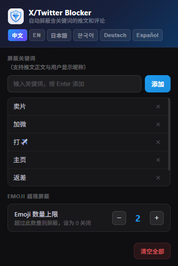

# X/Twitter Keyword Blocker

<div align="center">


**Sprache:**
[🇨🇳 中文](../README.md) · [🇺🇸 English](README_en.md) · [🇯🇵 日本語](README_ja.md) · [🇰🇷 한국어](README_ko.md) · [🇩🇪 Deutsch](README_de.md) · [🇪🇸 Español](README_es.md)

<br/>



</div>

---

## 📖 Einführung

**X/Twitter Keyword Blocker** ist ein leichtgewichtiges Browser-Tool, das Tweets und Kommentare auf X (ehemals Twitter) mit bestimmten Schlüsselwörtern automatisch ausblendet. Es unterstützt sowohl die **Chrome-Erweiterung** als auch das **Tampermonkey-Userscript**.

> [!IMPORTANT]
> **Die Standard-Keyword-Liste ist auf Chinesisch** verfasst und zielt auf chinesischsprachige Spam-Muster ab. Bevor Sie dieses Tool verwenden, **müssen Sie Ihre eigenen Keywords in Ihrer Sprache konfigurieren** — andernfalls hat der Blocker keine Wirkung auf nicht-chinesische Inhalte. (Die Schlüsselwortfilterung filtert sowohl **Tweet-Texte** als auch **Anzeigenamen**).
>
> - **Chrome-Erweiterung**: Erweiterungs-Icon klicken → Keywords hinzufügen (Änderungen werden automatisch gespeichert und angewendet)
> - **Tampermonkey**: Das `BLOCKED_KEYWORDS`-Array im Skript bearbeiten und `MAX_EMOJI_COUNT` nach Bedarf anpassen

### ✨ Funktionen

- 🚫 **Keyword-Filterung** — Versteckt automatisch Tweets/Kommentare und Anzeigenamen mit gesperrten Schlüsselwörtern
- 😶 **Emoji-Überflutungserkennung** — Blockiert Inhalte oder Nutzer, deren Anzahl an Emojis den Schwellwert übersteigt (Standard: > 2)
- ⚡ **Echtzeit** — `MutationObserver` erkennt dynamisch geladene Inhalte beim Scrollen
- 💾 **Persistente Speicherung** — Die Chrome-Erweiterung speichert Ihre Keywords lokal im Browser
- 🎨 **Visuelles Management-UI** — Die Chrome-Erweiterung bietet ein elegantes Popup zur Verwaltung von Keywords und Emoji-Schwellwert
- 🪶 **Ohne Abhängigkeiten** — Reines Vanilla JS, keine Performance-Einbußen
- 🔒 **Datenschutz** — Alles läuft lokal, keine Daten übertragen

---

## 🚀 Zwei Nutzungsmethoden

---

### Methode 1: Chrome-Erweiterung (Empfohlen)

Verwalten Sie Schlüsselwörter über ein visuelles Popup — keine Code-Änderungen nötig.

#### Installation

**1. Repository herunterladen**

```bash
git clone https://github.com/pengjinlong/x-twitter-blocker.git
```

**2. Chrome-Erweiterungsseite öffnen**

In der Adressleiste eingeben:

```
chrome://extensions/
```

**3. Entwicklermodus aktivieren**

Den Schalter **„Entwicklermodus"** oben rechts einschalten.

**4. Erweiterung laden**

Auf **„Entpackte Erweiterung laden"** klicken und den Ordner `chrome-extension/` auswählen.

**5. Fertig!**

Besuchen Sie [x.com](https://x.com) und klicken Sie auf das Erweiterungssymbol in der Toolbar, um Schlüsselwörter zu verwalten.

#### Bedienung

| Aktion | Beschreibung |
|--------|--------------|
| Erweiterungs-Icon klicken | Keyword-Verwaltungs-Popup öffnen |
| Keyword eingeben + „Hinzufügen" | Neues gesperrtes Keyword hinzufügen (Enter-Taste möglich; wird automatisch gespeichert und angewendet) |
| `×` neben Keyword klicken | Dieses Keyword entfernen (wird automatisch gespeichert und angewendet) |
| „Alle löschen“ klicken | Alle Keywords löschen |

---

### Methode 2: Tampermonkey-Userscript

Geeignet für Nutzer, die Tampermonkey bereits installiert haben und den Code direkt bearbeiten möchten.

#### Installation

**1. Tampermonkey installieren**

[Tampermonkey](https://www.tampermonkey.net/) aus dem Browser-Erweiterungsstore installieren.

**2. Skript installieren**

- Tampermonkey-Dashboard öffnen
- **„+"** klicken, um ein neues Skript zu erstellen
- Den gesamten Inhalt von [`index.js`](../index.js) einfügen
- `Ctrl + S` speichern

**3. Keywords und Emoji-Schwellwert konfigurieren**

`BLOCKED_KEYWORDS`-Array und Emoji-Schwellwert im Skript bearbeiten:

```javascript
// Gesperrte Keywords
const BLOCKED_KEYWORDS = [
    'Spam-Wort',
    'weiteres Wort',
    // Hier weitere hinzufügen
];

// Emoji-Überflutungs-Schwellwert (0 = deaktiviert)
const MAX_EMOJI_COUNT = 2;
```

**4. Fertig!**

X/Twitter-Seite neu laden — das Skript wirkt sofort.

---

## 📄 Lizenz

Dieses Projekt steht unter der [MIT-Lizenz](../LICENSE).

---

<div align="center">

⭐ Wenn dieses Tool hilfreich ist, gib ihm einen Star!

</div>
